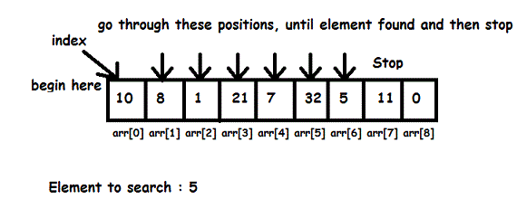
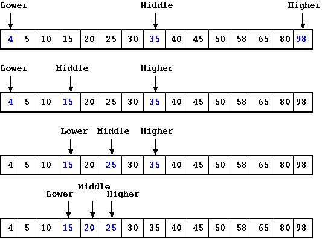

# Searching Algorithms

## What is Searching?

Searching is the process of finding a given value position in a list of values. It is a process of finding a particular item in a collection of items.

## Types of Searching Algorithms

1. Linear Search
2. Binary Search

## Linear Search

Linear search is a very simple search algorithm. In this type of search, a sequential search is made over all items one by one. Every item is checked and if a match is found then that particular item is returned, otherwise the search continues till the end of the data collection.



### Linear Search Pseudocode

```
linearSearch(arr, x) {
  for (let i = 0; i < arr.length; i++) {
    if (arr[i] === x) {
      return i;
    }
  }
  return -1;
}
```

### Linear Search Algorithm

1. Start from the leftmost element of arr[] and one by one compare x with each element of arr[]
2. If x matches with an element, return the index.
3. If x doesn’t match with any of elements, return -1.
4. Time Complexity: O(n)
5. Space Complexity: O(1)
6. Linear search is rarely used practically because other search algorithms such as the binary search algorithm and hash tables allow significantly faster searching comparison to Linear search.

## Binary Search

Binary Search is a searching algorithm for finding an element's position in a sorted array. In this approach, the element is always searched in the middle of a portion of an array.



### Binary Search Pseudocode

```
binarySearch(arr, x) {
  let start = 0;
  let end = arr.length - 1;
  while (start <= end) {
    let mid = Math.floor((start + end) / 2);
    if (arr[mid] === x) {
      return mid;
    } else if (arr[mid] < x) {
      start = mid + 1;
    } else {
      end = mid - 1;
    }
  }
  return -1;
}
```

### Binary Search Algorithm

1. Compare x with the middle element.
2. If x matches with the middle element, we return the mid index.
3. Else if x is greater than the mid element, then x can only lie in the right (greater) half subarray after the mid element. Then we apply the algorithm again for the right half.
4. Else if x is smaller, the target x must lie in the left (lower) half. So we apply the algorithm for the left half.
5. Time Complexity: O(log n)
6. Space Complexity: O(1)
7. Binary search is faster than linear search except for small arrays.
