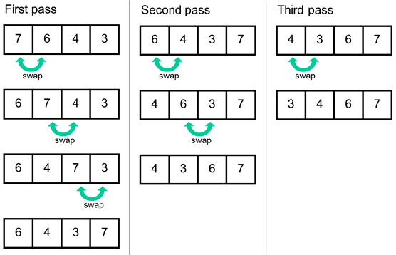
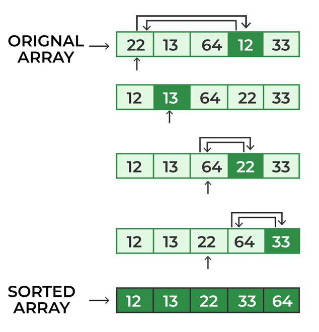
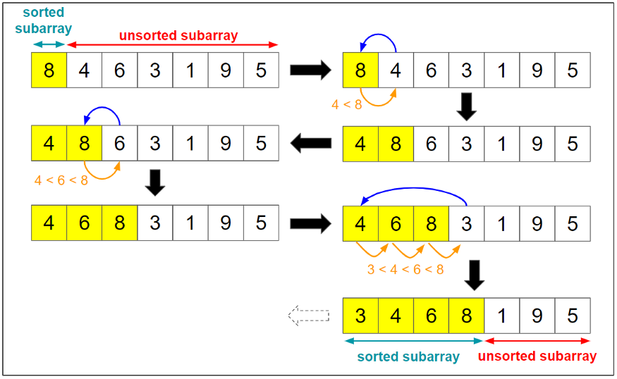
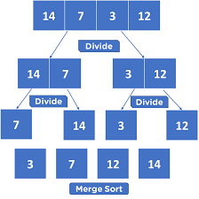
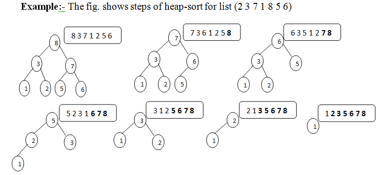

# Sorting Algorithms

## Table of Contents

- [Sorting Algorithms](#sorting-algorithms)
  - [Table of Contents](#table-of-contents)
  - [What is Sorting?](#what-is-sorting)
  - [Why Sorting?](#why-sorting)
  - [Types of Sorting Algorithms](#types-of-sorting-algorithms)
    - [Bubble Sort](#bubble-sort)
    - [Selection Sort](#selection-sort)
    - [Insertion Sort](#insertion-sort)
    - [Merge Sort](#merge-sort)
    - [Quick Sort](#quick-sort)
    - [Heap Sort](#heap-sort)

## What is Sorting?

- Sorting is the process of arranging elements in a specific order.
- The most common orders are numerical order and lexicographical order.
- The most common numerical order is the ascending order.
- The most common lexicographical order is the dictionary order.
- Sorting is used in a wide range of applications, and it is a fundamental part of computer science.
- Sorting is used to optimize the use of other algorithms that require sorted input data.

## Why Sorting?

- To make searching easier.
- To make data retrieval easier.
- To make data processing easier.
- To make data storage easier.
- To make data visualization easier.
- To make data analysis easier.
- To make data manipulation easier.
- To make data management easier.
- To make data representation easier.
- To make data understanding easier.
- To make data communication easier.

## Types of Sorting Algorithms

### Bubble Sort

- Bubble Sort is the simplest sorting algorithm that works by repeatedly swapping the adjacent elements if they are in the wrong order.
- The pass through the list is repeated until the list is sorted.
- The algorithm gets its name from the way smaller elements "bubble" to the top of the list.
- Bubble Sort is not a practical sorting algorithm when n is large.
- It will not be efficient in the case of a reverse-ordered list.
- It is not a stable sorting algorithm.
- Performance:

  - Worst Case: O(n^2)
  - Best Case: O(n)
  - Average Case: O(n^2)
  - Space: O(1)

  

- Pseudo Code:

  ```
  Bubble Sort(arr, size)
  		for i=0 to n-i-1
  			for j=0 to n-i-2
  				if arr[j]>arr[j+1]
  					Swap arr[j] and arr[j+1]

  ```

### Selection Sort

- Selection Sort is an in-place comparison sorting algorithm.
- It divides the input list into two parts: the sublist of items already sorted and the sublist of items remaining to be sorted.
- It repeatedly finds the minimum element from the unsorted part and swaps it with the first element of the unsorted part.
- Performance:

  - Worst Case: O(n^2)
  - Best Case: O(n^2)
  - Average Case: O(n^2)
  - Space: O(1)

  

- Pseudo Code:

  ```
  SelectionSort(arr, n)
  iterate (n - 1) times
  set the first unsorted element index as the min
  	 for each of the unsorted elements
    		if element < currentMin
     			set element's index as new min
  	 swap element at min with first unsorted position
  end selectionSort
  ```

### Insertion Sort

- Insertion Sort is a simple sorting algorithm that builds the final sorted array one item at a time.
- It is much less efficient on large lists than more advanced algorithms such as quicksort, heapsort, or merge sort.
- Performance:

  - Worst Case: O(n^2)
  - Best Case: O(n)
  - Average Case: O(n^2)
  - Space: O(1)

  

- Pseudo Code:

  ```
  Insertion Sort(arr, size)
  	consider 0th element as sorted part
  			for each element from i=2 to n-1
  			tmp = arr[i]
  			for j=i-1 to 0
  				If a[j]>tmp
  				  Then right shift it by one position
  			put tmp at current j
  ```

### Merge Sort

- Merge Sort is a divide and conquer algorithm that was invented by John von Neumann in 1945.
- It is an efficient, stable, and comparison-based sorting algorithm.
- Most implementations produce a stable sort, meaning that the implementation preserves the input order of equal elements in the sorted output.
- Performance:

  - Worst Case: O(n log n)
  - Best Case: O(n log n)
  - Average Case: O(n log n)
  - Space: O(n)

  

- Pseudo Code:

  ```
  MergeSort(arr, left, right):
    if left > right
        return
    mid = (left+right)/2
    mergeSort(arr, left, mid)
    mergeSort(arr, mid+1, right)
    merge(arr, left, mid, right)
  end MergeSort
  ```

### Quick Sort

- Quick Sort is an efficient, in-place sorting algorithm that in practice is faster than Merge Sort and Heap Sort.
- It is a comparison-based algorithm that uses divide and conquer strategy to divide the input array into two sub-arrays and then recursively sort the sub-arrays.
- Performance:

  - Worst Case: O(n^2)
  - Best Case: O(n log n)
  - Average Case: O(n log n)
  - Space: O(log n)

  

- Pseudo Code:

  ```
  quickSort(arr, beg, end)
  if (beg < end)
    pivotIndex = partition(arr,beg, end)
    quickSort(arr, beg, pivotIndex)
    quickSort(arr, pivotIndex + 1, end)
  ```

  ```
  partition(arr, beg, end)
  set end as pivotIndex
  pIndex = beg - 1
  for i = beg to end-1
  if arr[i] < pivot
    swap arr[i] and arr[pIndex]
    pIndex++
  swap pivot and arr[pIndex+1]
  return pIndex + 1
  ```

### Heap Sort

- Heap Sort is a comparison-based sorting algorithm that uses a binary heap data structure.
- Performance:

  - Worst Case: O(n log n)
  - Best Case: O(n log n)
  - Average Case: O(n log n)
  - Space: O(1)

  

- Pseudo Code:

  ```
  Heapsort(arr)
  buildMaxHeap(arr)
  for (int i = n - 1; i >= 0; i--) {
      	  swap(&arr[0], &arr[i]);
    heapsize--;
    maxHeapify(arr,0);
  	}
  ```
